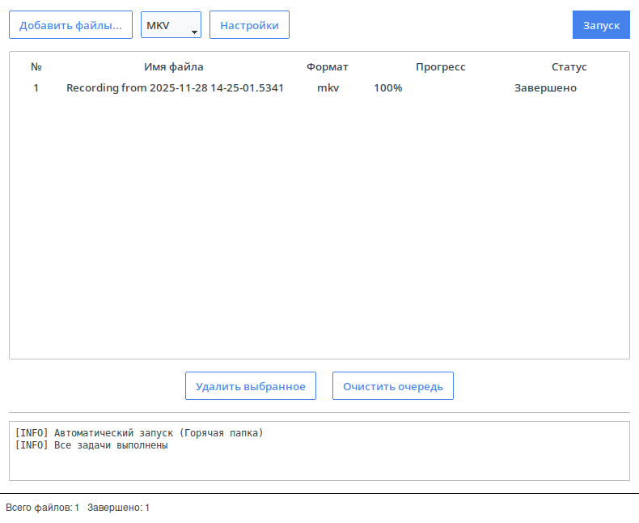
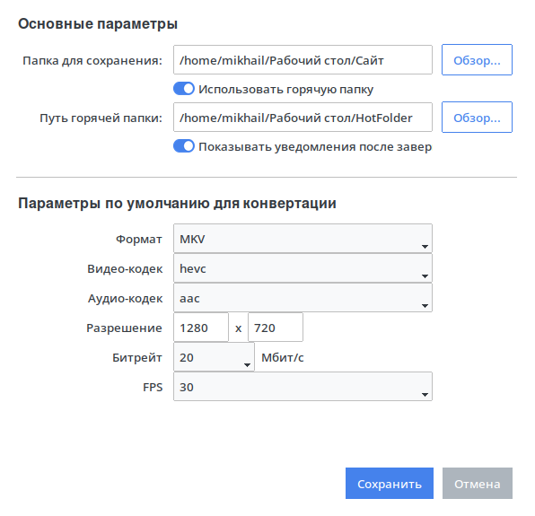

# VideoConverter


Кроссплатформенное десктопное приложение для пакетной конвертации видеофайлов и автоматизации обработки медиаданных. Проект разработан в рамках учебной дисциплины «Инструментальные средства разработки программного обеспечения».

## Оглавление

- [Описание](#описание)
- [Функциональные возможности](#функциональные-возможности)
- [Стек технологий](#стек-технологий)
- [Демонстрация](#демонстрация)
- [Установка и запуск](#установка-и-запуск)
- [Использование](#использование)
- [Структура проекта](#структура-проекта)
- [Лицензия](#лицензия)

## Описание

VideoConverter представляет собой графическую оболочку и интерфейс командной строки для утилиты FFmpeg. Приложение решает проблему рутинного перекодирования видео, предоставляя удобный интерфейс для настройки кодеков, разрешения и битрейта.

Ключевой особенностью является функция «Горячая папка» (Hot Folder), которая позволяет автоматизировать процесс: приложение отслеживает изменения в указанной директории и автоматически конвертирует новые файлы.

## Функциональные возможности

* **Графический интерфейс (GUI)** на базе Tkinter с современным дизайном.
* **Интерфейс командной строки (CLI)** для работы на серверах и в скриптах.
* **Пакетная обработка** списков файлов с очередью задач.
* **Фоновый мониторинг папок** для автоматического запуска конвертации.
* **Управление потоками:** возможность приостановки (Pause), возобновления (Resume) и остановки (Stop) процесса кодирования.
* **Настройка профилей:** выбор контейнеров (MP4, MKV, AVI, MOV), видео/аудио кодеков, разрешения и FPS.
* **Валидация данных** для предотвращения ошибок FFmpeg.

## Стек технологий

* **Язык:** Python 3.10+
* **Ядро обработки:** FFmpeg (через модуль `subprocess`)
* **GUI:** Tkinter + ttkbootstrap
* **Управление процессами:** psutil
* **Многопоточность:** threading

## Демонстрация

**Главное окно приложения:**


**Окно настроек:**


## Установка и запуск

### Предварительные требования

1.  Установленный интерпретатор **Python 3.10** или выше.
2.  Установленная утилита **FFmpeg**, доступная через переменную окружения PATH.

### Инструкция по установке

1.  Клонируйте репозиторий:
    ```bash
    git clone [https://github.com/Misha-Burtsev/VideoConverter.git](https://github.com/Misha-Burtsev/VideoConverter.git)
    cd VideoConverter
    ```

2.  Создайте и активируйте виртуальное окружение (рекомендуется):
    ```bash
    python -m venv venv
    # Linux:
    source venv/bin/activate
    # Windows:
    venv\Scripts\activate
    ```

3.  Установите зависимости:
    ```bash
    pip install -r requirements.txt
    ```

## Использование

### Графический режим
Для запуска приложения с интерфейсом выполните команду без аргументов:
```bash
python main.py
```
### Консольный режим

Приложение поддерживает работу через аргументы командной строки.

Синтаксис:

```Bash
python main.py [файлы] [опции]
```
Примеры:

Конвертация одного файла:
```Bash
python main.py video.avi -f mp4
```
Конвертация с настройкой параметров:
```Bash
python main.py video.mkv -f mp4 -o ./out --video-bitrate 2M --resolution 1280x720
```
Доступные флаги:

    -f, --format: Целевой формат (обязательно).

    -o, --output-dir: Папка для сохранения.

    --video-bitrate: Битрейт видео (например, 2M, 800k).

    --audio-bitrate: Битрейт аудио (например, 192k).

    --resolution: Разрешение кадра (например, 1920x1080).

## Структура проекта
```Plaintext

VideoConverter/
├── main.py                 # Точка входа в приложение
├── models.py               # Описание структур данных (Job, Settings)
├── converter.py            # Обертка над процессом FFmpeg
├── service.py              # Бизнес-логика и управление потоками
├── gui.py                  # Графический интерфейс (MainWindow)
├── settings_window.py      # Логика окна настроек
├── cli.py                  # Обработка аргументов командной строки
└── README.md               # Документация проекта
```
Лицензия

Данный проект распространяется под лицензией GNU General Public License v3.0 (GPLv3). Подробности см. в файле LICENSE.