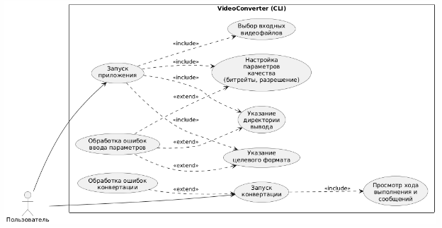
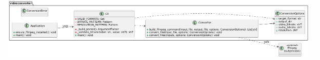

# VideoConverter

Проект учебного приложения для конвертации видеофайлов по дисциплине  
«Инструментальные средства разработки программного обеспечения с открытым исходным кодом».

Ядро конвертации основано на утилите FFmpeg.

## Возможности

- Конвертация одного или нескольких входных видеофайлов.
- Выбор целевого формата (`-f/--format`, например: `mp4`, `avi`, `mkv`).
- Задание директории для выходных файлов (`-o/--output-dir`).
- Настройка параметров качества:
  - битрейт видео (`--video-bitrate`, например `2M`, `800k`);
  - битрейт аудио (`--audio-bitrate`, например `192k`);
  - разрешение выходного видео (`--resolution`, например `1920x1080`).
- Обработка ошибок:
  - проверка наличия утилиты `ffmpeg` в PATH;
  - проверка существования входных файлов;
  - обработка ошибок при выполнении команды `ffmpeg`.

## Требования

- Python 3.10+.
- Установленный `ffmpeg`, доступный в переменной окружения `PATH`.

Примеры установки FFmpeg:
- Debian/Ubuntu: `sudo apt install ffmpeg`
- Другие системы: актуальная информация на сайте проекта FFmpeg.

## Запуск

Из корня проекта:

```bash
python main.py input.avi -f mp4
python main.py film.mkv clip.avi -f mp4 -o converted
python main.py video.mkv -f mp4 --video-bitrate 2M --audio-bitrate 192k --resolution 1280x720
python main.py test1.mkv test2.avi -f mp4 --video-bitrate 2M --audio-bitrate 128k
```

## UML-диаграммы

Ниже приведены UML-диаграммы, описывающие структуру и логику CLI-версии приложения VideoConverter.

### Диаграмма вариантов использования


*Диаграмма вариантов использования отражает взаимодействие пользователя с системой VideoConverter и включает операции выбора файлов, указания формата, настройки параметров и запуска конвертации.*

### Диаграмма классов


*Диаграмма классов демонстрирует структуру проекта и связи между модулями Application, Cli, Converter, ConversionOptions и ConversionError.*

## Назначение модулей проекта

**main.py**  
Точка входа программы. Проверяет наличие утилиты FFmpeg и запускает CLI-интерфейс.

**videoconverter/cli.py**  
Реализует консольный интерфейс: парсинг аргументов командной строки, валидацию формата, разрешения и битрейтов, а также вызов функций модуля `converter.py`.

**videoconverter/converter.py**  
Содержит основную бизнес-логику конвертации. Формирует команду FFmpeg, выполняет обработку одного или нескольких файлов и выводит результаты. Отвечает за обработку ошибок конвертации.

**videoconverter/__init__.py**  
Маркирует пакет `videoconverter`, используется для структурирования модулей проекта.

**README.md**  
Содержит описание проекта, инструкции по запуску и UML-диаграммы.